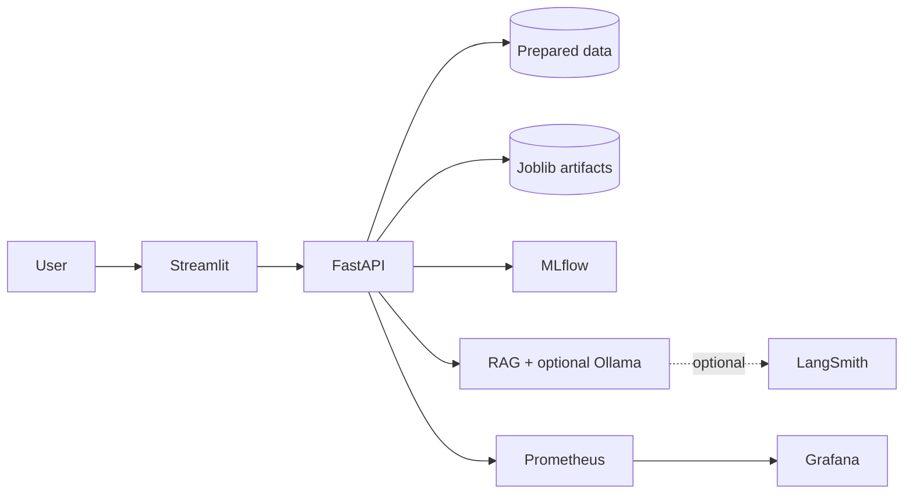

# AI Commerce Analytics Platform

[](../../actions/workflows/ci.yml)


> **Project banner placeholder:** add a branded product image at `docs/images/project-banner.png` when available.

An ecommerce analytics project that combines data preparation, machine-learning models, a FastAPI backend, and a Streamlit dashboard.

## Recruiter snapshot

An end-to-end AI commerce analytics workspace demonstrating data preparation, applied machine learning, RAG operations, Dockerized delivery, CI, experiment tracking, tracing, and production-style monitoring.



## Documentation

- [Project Overview](docs/01_Project_Overview.md)
- [System Architecture](docs/02_System_Architecture.md)
- [Data Pipeline](docs/03_Data_Pipeline.md)
- [Machine Learning](docs/04_Machine_Learning.md)
- [RAG Architecture](docs/05_RAG_Architecture.md)
- [API Documentation](docs/06_API_Documentation.md)
- [Deployment Guide](docs/07_Deployment_Guide.md)
- [Project Structure](docs/08_Project_Structure.md)
- [Monitoring](docs/09_Monitoring.md)
- [Recruiter README source](docs/10_README.md)

## Project tech stack

- **Data and ML:** Python, pandas, scikit-learn, XGBoost, joblib, PyArrow
- **Backend:** FastAPI and Uvicorn
- **Frontend:** Streamlit, Plotly, and requests
- **Experiment tracking:** MLflow with SQLite metadata and local artifact storage
- **RAG observability:** LangSmith tracing and offline evaluation (optional, RAG only)
- **Deployment:** Docker and Docker Compose
- **Data artifacts:** Parquet/CSV prepared datasets and saved `.joblib` models

## Project structure

```text
AI-Commerce-Analytics-Platform/
├── backend/                 # FastAPI application and API Dockerfile
├── streamlit/               # Streamlit dashboard and UI Dockerfile
├── src/                     # Shared data, feature, and service code
├── pipelines/               # Repeatable data/feature/model artifact jobs
├── data/processed/          # Prepared dataset mounted into FastAPI
├── models/                  # Saved model artifacts mounted into FastAPI
├── mlflow/                  # Generated MLflow SQLite metadata and artifacts (ignored by Git)
├── rag_ops/                 # Generated privacy-safe RAG events and evaluation reports (ignored by Git)
├── notebooks/               # Exploratory and model-development notebooks
├── docker-compose.yml       # Starts the complete application stack
├── prometheus.yml           # Prometheus scrape configuration
├── grafana/                 # Provisioned Grafana datasource, alerts, and dashboards
├── .dockerignore            # Keeps Docker build contexts small
└── .env.example             # Docker configuration template
```

## Docker installation

Install [Docker Desktop](https://www.docker.com/products/docker-desktop/) and confirm it is running:

```powershell
docker --version
docker compose version
```

Optionally create local configuration from the template:

```powershell
Copy-Item .env.example .env
```

The default configuration works without creating `.env`.

## Cloud deployment on Render

This repository includes [render.yaml](render.yaml), a Render Blueprint that deploys the Docker application as three web services in the same Render region:

```text
Browser
  │
  ▼
Public Streamlit web service
  │  (Render private network)
  ▼
FastAPI web service ───► MLflow web service
  │
  ▼
Backend persistent disk (/var/data)
  ├── processed/master_df.parquet
  ├── models/*.joblib
  └── rag_ops/ logs and evaluation reports
```

Streamlit connects to FastAPI using Render's injected private hostname, never `localhost`. MLflow also receives an internal hostname. The backend, Streamlit, and MLflow services all bind to Render's required `$PORT`, have HTTP health checks, and send startup logs to standard output.

### Important Render limitation: model and data assets

Render does not run `docker-compose.yml` as a single deployment. Its filesystem is ephemeral by default, and a persistent disk can be attached to only one service and is unavailable during image build. The backend therefore uses a paid 10 GB persistent disk and downloads assets at runtime from `ASSET_BUNDLE_URL`.

Host a private ZIP in S3, Cloudflare R2, Google Cloud Storage, Hugging Face, or another secure object store. The ZIP must have exactly this layout:

```text
processed/master_df.parquet
models/customer_churn_model.joblib
models/customer_clv_model.joblib
models/customer_review_sentiment_model.joblib
models/demand_forecasting_model.joblib
models/product_recommender_system.joblib
models/rag_retriever.joblib
```

Use a private, time-limited signed URL. Never commit the asset bundle or URL to Git.

### Create an asset bundle locally

```powershell
New-Item -ItemType Directory -Force deploy-assets/processed, deploy-assets/models
Copy-Item data/processed/master_df.parquet deploy-assets/processed/
Copy-Item models/*.joblib deploy-assets/models/
Compress-Archive -Path deploy-assets/processed, deploy-assets/models -DestinationPath ai-commerce-assets.zip
```

Upload `ai-commerce-assets.zip` to your chosen private object store and generate a signed download URL.

### Deploy from the Render Dashboard

1. Push the repository, including `render.yaml`, to GitHub.
2. In Render, choose **New** → **Blueprint**, select the repository, and review the three services.
3. Provide the prompted `ASSET_BUNDLE_URL` secret.
4. After Streamlit receives its Render URL, set backend `CORS_ORIGINS` to that exact URL (for example, `https://ai-commerce-streamlit.onrender.com`).
5. Apply the Blueprint. Render builds the Docker images, starts services, checks health endpoints, and downloads the bundle only to the backend disk.
6. Open the generated Streamlit, FastAPI, and MLflow URLs from the Render dashboard.

Set `RAG_LLM_ENABLED=false` on Render unless you configure a reachable hosted Ollama-compatible endpoint. `host.docker.internal` points to a developer machine only in local Docker; Render cannot reach a local Ollama process.

### Verify the Render deployment

- FastAPI: open `https://<backend-service>.onrender.com/api/v1/health` and expect an `ok` response.
- Swagger: open `https://<backend-service>.onrender.com/docs`.
- Streamlit: open the public Streamlit URL and check that customer metrics load.
- MLflow: open the public MLflow service URL, then run a tracked pipeline from the backend shell if desired.
- Logs: in Render, open each service's **Logs** tab. A missing or malformed asset bundle causes the backend startup script to exit with an explicit error instead of serving incomplete model endpoints.

### Render troubleshooting and alternatives

- **Backend fails at startup:** verify that the signed `ASSET_BUNDLE_URL` is still valid and the ZIP has the required `processed/` and `models/` root folders.
- **Model endpoint fails after deploy:** inspect backend logs and confirm the matching `.joblib` exists on the backend disk.
- **Streamlit cannot reach FastAPI:** keep both services in the same Render workspace and region; the Blueprint injects the backend's private host and port automatically.
- **Disk cost or size is insufficient:** increase the Render disk before uploading a larger asset bundle. A service with a disk cannot scale to multiple instances.
- **Need an unchanged Docker Compose stack:** use a small VM such as a DigitalOcean Droplet and run `docker compose up -d`. This is the simplest alternative when all services must share the exact Compose environment. For managed scaling, use Cloud Run/ECS with object storage instead of local model files.

## Start with Docker Compose

Build images and start FastAPI, Streamlit, and the MLflow Tracking Server in the background:

```powershell
docker compose up --build -d
```

Follow service logs during startup:

```powershell
docker compose logs -f
```

## Stop and rebuild

Stop containers while keeping data/models on the host:

```powershell
docker compose down
```

Rebuild after Dockerfile or dependency changes:

```powershell
docker compose build --no-cache
docker compose up -d
```

## Service access and health checks

| Service | URL | Container health check |
| --- | --- | --- |
| Streamlit dashboard | [http://localhost:8501](http://localhost:8501) | `http://localhost:8501/_stcore/health` |
| FastAPI API | [http://localhost:8000](http://localhost:8000) | `http://localhost:8000/api/v1/health` |
| Swagger UI | [http://localhost:8000/docs](http://localhost:8000/docs) | Uses the FastAPI health check |
| MLflow UI | [http://localhost:5000](http://localhost:5000) | `http://localhost:5000/health` |

Check container status:

```powershell
docker compose ps
```

Both services should show `healthy`. You can also query FastAPI directly:

```powershell
Invoke-RestMethod http://localhost:8000/api/v1/health
```

## Docker networking and volumes

Compose creates the `ai-commerce-network` bridge network. Streamlit uses Docker DNS to call `http://backend:8000/api/v1`; it never uses `localhost` inside its container.

The backend receives these read-only mounts, so large artifacts are not copied into the Docker image:

- `./data:/app/data:ro`
- `./models:/app/models:ro`

MLflow persists experiment metadata in `./mlflow/mlflow.db` and artifacts in `./mlflow/artifacts` using a Docker volume mapping.

## MLflow experiment tracking

The MLflow-enabled training command supports these experiments:

- `churn` — classification metrics, confusion matrix, ROC, PR, and feature importance
- `clv` and `delivery_delay` — regression metrics, prediction plot, and feature importance
- `recommendations` — Precision@K, Recall@K, MAP, and NDCG
- `sentiment` — classification metrics, confusion matrix, ROC, and PR curves
- `demand_forecasting` — RMSE, MAE, MAPE, and prediction plot

Each run logs parameters, dataset version, random seed, feature names, Git commit hash, training duration, MLflow model artifact, and a backward-compatible joblib artifact.

### Start MLflow locally

Install project dependencies, then point MLflow at a local tracking directory:

```powershell
python -m pip install -r backend/requirements.txt
$env:MLFLOW_TRACKING_URI = "file:./mlruns"
```

For the Docker tracking server, start the full stack instead:

```powershell
docker compose up --build -d
```

Open the MLflow UI at [http://localhost:5000](http://localhost:5000).

### Log experiments

With the Docker stack running, execute a training job in the backend container:

```powershell
docker compose exec backend python -m pipelines.training.train churn
docker compose exec backend python -m pipelines.training.train clv
docker compose exec backend python -m pipelines.training.train delivery_delay
docker compose exec backend python -m pipelines.training.train recommendations
docker compose exec backend python -m pipelines.training.train sentiment
docker compose exec backend python -m pipelines.training.train demand_forecasting
```

Run every experiment sequentially with:

```powershell
docker compose exec backend python -m pipelines.training.train all
```

### Compare experiments

1. Open the MLflow UI.
2. Select an `AI-Commerce-*` experiment.
3. Select two or more runs and choose **Compare**.
4. Compare metrics, parameters, feature-importance plots, curves, and model artifacts.

### Verify MLflow

```powershell
docker compose ps
docker compose logs mlflow
```

`ai-commerce-mlflow` should be healthy. After running a training command, refresh the MLflow UI and confirm that the experiment, run metrics, parameters, and artifacts appear.

### MLflow screenshots

Add screenshots here after the first successful run:

- MLflow experiment list
- Run comparison table
- Feature importance, ROC, PR, or regression prediction artifacts

## Prometheus monitoring

Prometheus monitors only operational measurements. It does not collect request bodies, customer IDs, model feature values, prompts, answers, or API keys.

### Start the monitoring stack

Prometheus, Node Exporter, and cAdvisor start with the standard Compose command:

```powershell
docker compose up --build -d
```

Open the following pages:

| Component | Address | Purpose |
| --- | --- | --- |
| FastAPI metrics | [http://localhost:8000/metrics](http://localhost:8000/metrics) | Raw application, model, RAG, and Python process metrics |
| Prometheus UI | [http://localhost:9090](http://localhost:9090) | Query metrics and inspect targets |
| Prometheus targets | [http://localhost:9090/targets](http://localhost:9090/targets) | Confirm every scrape target is `UP` |

[prometheus.yml](prometheus.yml) defines jobs for FastAPI, Prometheus, Node Exporter, and cAdvisor. Prometheus stores its local history in the named `prometheus_data` Docker volume.

### Application metrics

- **HTTP:** `http_requests_total`, `http_request_duration_seconds`, `http_errors_total`, and `active_requests`.
- **Models:** `prediction_requests_total`, `prediction_errors_total`, `prediction_latency_seconds`, `model_loading_seconds`, `model_loading_errors_total`, and `loaded_models`.
- **RAG:** `chatbot_requests_total`, `chatbot_errors_total`, `rag_latency_seconds`, `rag_retriever_latency_seconds`, `rag_llm_latency_seconds`, and `rag_retrieved_documents`.
- **System/container:** the Prometheus Python client exports API process CPU, memory, and start-time metrics on Linux. Node Exporter adds host/VM CPU, memory, disk, network, and uptime metrics. cAdvisor adds Docker container CPU, memory, network, and start-time metrics.

### Useful PromQL queries

```promql
# API requests per second over five minutes.
sum(rate(http_requests_total[5m]))

# 95th-percentile request latency by endpoint.
histogram_quantile(0.95, sum by (le, endpoint) (rate(http_request_duration_seconds_bucket[5m])))

# Prediction success rate by model.
sum by (model_name) (rate(prediction_requests_total{outcome="success"}[5m]))
/ sum by (model_name) (rate(prediction_requests_total[5m]))

# RAG error rate over five minutes.
sum(rate(chatbot_errors_total[5m])) / sum(rate(chatbot_requests_total[5m]))

# Average retrieved document count.
rate(rag_retrieved_documents_sum[5m]) / rate(rag_retrieved_documents_count[5m])

# Container uptime in seconds.
time() - container_start_time_seconds
```

### Verification checklist

1. Run `docker compose up --build -d` and confirm `docker compose ps` shows Prometheus running.
2. Open `/metrics` and search for `http_requests_total`.
3. Open Prometheus **Status → Targets** and confirm `fastapi`, `prometheus`, `node_exporter`, and `cadvisor` are `UP`.
4. Submit a churn or CLV prediction, then query `prediction_requests_total` in Prometheus.
5. Ask the RAG chatbot a question, then query `chatbot_requests_total` and `rag_latency_seconds_count`.
6. Stop Ollama while generation is enabled, submit another question, and confirm `chatbot_errors_total` increases if the RAG request cannot recover.

### Monitoring troubleshooting and best practices

- **FastAPI target is down:** wait for the backend health check, then inspect `docker compose logs backend` and open `http://localhost:8000/metrics` directly.
- **Exporter target is down:** Node Exporter and cAdvisor require Linux host paths. With Docker Desktop, they report on Docker's Linux VM rather than native Windows/macOS host metrics. Disable those services if local Docker policy blocks the required mounts; FastAPI and Prometheus monitoring continue to work.
- **Prometheus data is missing after recreation:** use `docker compose down` rather than `docker compose down -v` to retain the named `prometheus_data` volume.
- **Production:** do not publish Prometheus publicly. Place it behind a VPN, reverse-proxy authentication, or a private network; use bounded labels only; set retention and alerting rules appropriate to available disk; and avoid recording sensitive data in labels.

## Grafana dashboards

Grafana is provisioned automatically from the repository. It uses the internal Prometheus service, so no datasource URL needs to be configured manually.

### Start and sign in

```powershell
docker compose up --build -d
docker compose ps
```

Open [http://localhost:3000](http://localhost:3000) and sign in with the local-development values from `.env`:

```text
Username: admin
Password: admin
```

Change `GRAFANA_ADMIN_PASSWORD` before using any environment beyond local development, then recreate Grafana:

```powershell
docker compose up -d --force-recreate grafana
```

### Provisioned resources

- [Prometheus datasource](grafana/provisioning/datasources/prometheus.yml) connects to `http://prometheus:9090` over the Compose network.
- [Dashboard provider](grafana/provisioning/dashboards/dashboards.yml) auto-loads JSON files into **AI Commerce Monitoring**.
- [Alert rules](grafana/provisioning/alerting/alerts.yml) provision API down, high latency, high error rate, prediction failure, chatbot failure, high CPU, and high memory alerts. They appear in Grafana Alerting but do not send notifications until you configure a contact point.
- [FastAPI dashboard](grafana/dashboards/api_dashboard.json), [ML dashboard](grafana/dashboards/ml_dashboard.json), [RAG dashboard](grafana/dashboards/rag_dashboard.json), and [Infrastructure dashboard](grafana/dashboards/infrastructure_dashboard.json) are version-controlled and loaded at startup.

Dashboards are read-only in Grafana because their source of truth is Git. To customise one, edit its JSON file, wait up to 30 seconds, and refresh Grafana. You can also import a JSON file manually from **Dashboards → New → Import**; do not reuse its UID on the same Grafana instance.

### Dashboard PromQL reference

| Dashboard | Examples of provisioned queries |
| --- | --- |
| FastAPI | `sum(rate(http_requests_total[5m]))`, `histogram_quantile(0.95, sum by (le, endpoint) (rate(http_request_duration_seconds_bucket[5m])))` |
| ML | `sum(increase(prediction_requests_total[1h]))`, `histogram_quantile(0.95, sum by (le, model_name) (rate(prediction_latency_seconds_bucket[5m])))` |
| RAG | `sum(increase(chatbot_requests_total[1h]))`, `histogram_quantile(0.95, sum by (le) (rate(rag_latency_seconds_bucket[5m])))` |
| Infrastructure | `1 - avg(rate(node_cpu_seconds_total{mode="idle"}[5m]))`, `sum by (name) (container_memory_working_set_bytes{name!=""})` |

The full PromQL expression for every panel is stored beside the dashboard definition in `grafana/dashboards/`.

### Grafana verification checklist

1. Confirm `docker compose ps` reports Grafana as healthy.
2. Open **Connections → Data sources → Prometheus** and click **Save & test**; it should connect successfully.
3. Open **Dashboards → AI Commerce Monitoring** and confirm all four dashboards are present.
4. Submit a model prediction and RAG question, then refresh the ML and RAG dashboards after the next 15-second Prometheus scrape.
5. Open **Alerting → Alert rules** and confirm all seven provisioned rules are visible.
6. For a safe alert test, temporarily stop the backend for more than two minutes, then confirm **API Down** becomes alerting. Start it again afterwards.

### Grafana troubleshooting and production practices

- **Grafana starts but has no dashboards:** inspect `docker compose logs grafana`; confirm the `grafana/` folders are mounted and JSON files are valid.
- **Datasource is unavailable:** confirm `docker compose ps prometheus`, then open `http://localhost:9090/targets` and check that Prometheus is healthy.
- **No data in panels:** generate API traffic, wait for one scrape interval, and run the panel query directly in Prometheus first.
- **Dashboards do not update after editing JSON:** wait 30 seconds or restart Grafana; provisioned dashboards are overwritten from source files at startup.
- **Production:** replace the default password with a secret, terminate TLS at a trusted reverse proxy, restrict Grafana and Prometheus to a private network, configure contact points and notification policies, back up `grafana_data`, and pin/update container images regularly.

### Dashboard screenshots

Add screenshots after the first successful local run:

- FastAPI request and error overview
- ML latency and prediction count dashboard
- RAG latency and chatbot outcome dashboard
- Infrastructure resource dashboard
- Grafana alert rule list

## RAG LLMOps workflow

The RAG chatbot includes lightweight LLMOps controls without changing other analytics models:

- **Prompt versioning:** [prompt_registry.py](backend/app/llmops/prompt_registry.py) stores a named, versioned prompt template. Its version is returned with every chat response.
- **Knowledge-base versioning:** the saved retriever artifact is fingerprinted from its name, size, and modification timestamp. Each query records the active version.
- **Privacy-safe query logging:** `rag_ops/rag_events.jsonl` stores a salted query hash, text lengths, source types, versions, latency, and evaluation scores. It never stores raw questions, retrieved context, or generated answers.
- **Evaluation reports:** `rag_ops/evaluation_report.json` is refreshed after each query. Faithfulness, answer relevance, and context relevance are transparent token-overlap monitoring signals; use human evaluation or an LLM judge for higher-stakes quality reviews.
- **RAG dashboard:** open the Streamlit **RAG Operations** page to review query volume, evaluation averages, latency percentiles, and prompt/knowledge-base version usage.

### Optional Ollama generation

By default, the chatbot returns retrieved context only, preserving the existing workflow. To enable an Ollama model, copy the environment template and set:

```powershell
Copy-Item .env.example .env
```

```dotenv
RAG_LLM_ENABLED=true
OLLAMA_BASE_URL=http://host.docker.internal:11434
OLLAMA_MODEL=llama3.2
```

Start Ollama and pull the selected model on the host, then recreate the backend:

```powershell
ollama pull llama3.2
docker compose up --build -d
```

The backend communicates with Ollama only when `RAG_LLM_ENABLED=true`; if Ollama is unavailable, it falls back safely to retrieved context and continues logging retrieval operations.

### Verify RAG operations

1. Ask a question on the Streamlit **RAG Chatbot** page.
2. Confirm the prompt and knowledge-base versions appear below the answer.
3. Open **RAG Operations** to view query count, latency, and evaluation signals.
4. Inspect `rag_ops/evaluation_report.json` locally for the generated aggregate report.
5. Call `GET /api/v1/rag/metrics` or inspect Swagger UI for the raw dashboard payload.

## LangSmith observability for the RAG chatbot

LangSmith is optional and instruments only the RAG chatbot. It does not trace, change, or send data from customer analytics, prediction models, recommendation models, sentiment analysis, or demand forecasting.

### Configure tracing

1. Create a LangSmith API key in the LangSmith dashboard.
2. Copy the environment template, then set the key locally without committing `.env`:

```powershell
Copy-Item .env.example .env
```

```dotenv
LANGCHAIN_TRACING_V2=true
LANGCHAIN_API_KEY=<your-langsmith-api-key>
LANGCHAIN_PROJECT=AI-Commerce-Analytics-Platform
LANGCHAIN_ENDPOINT=https://api.smith.langchain.com
```

3. Restart the backend so Docker Compose passes the new values into FastAPI:

```powershell
docker compose up --build -d backend
```

The application maps these requested LangChain-compatible variable names to the current LangSmith SDK names internally. Keep tracing disabled (`false`) when working with sensitive data unless your LangSmith workspace's data handling policies have been reviewed.

### Traces and debugging

Submit a question in Streamlit's **RAG Chatbot** page, then open the configured `AI-Commerce-Analytics-Platform` project in LangSmith. Each request is grouped under the `ai_commerce_rag_pipeline` chain and includes these child runs:

- `rag_retriever`: query, retrieved documents, source labels, similarity scores, chunk count, and retrieval latency.
- `rag_prompt_template`: rendered reusable prompt and prompt version.
- `rag_ollama_request` / `rag_llm`: model name, response latency, token counts when Ollama returns them, and nested timeout/connection failures.
- `rag_output_parser`: normalized final answer.

Every trace carries the `ai-commerce`, `rag`, and `ollama` tags plus prompt, knowledge-base, and model metadata. Raw questions, context, prompts, and answers are visible in LangSmith by design for debugging. The local `rag_ops` files remain privacy-safe and store hashes and aggregate measurements rather than raw chat content.

### Run an offline RAG evaluation

Create a LangSmith dataset with an input field named `question`. Optionally add `expected_sources` (for example, `["Product", "Review"]`) for retrieval-accuracy scoring. Run:

```powershell
docker compose exec backend python -m pipelines.evaluation.evaluate_rag --dataset "AI Commerce RAG Evaluation"
```

The run creates a LangSmith experiment with answer relevance, context relevance, faithfulness/groundedness, retrieval accuracy, and hallucination-risk scores. These initial scores are deterministic token-overlap proxies. For release decisions, supplement them with curated reference answers, human review, or LangSmith LLM-as-judge evaluators.

### LangSmith troubleshooting

- **No traces:** confirm `LANGCHAIN_TRACING_V2=true`, a valid API key, and the correct project name; then restart the backend.
- **Retriever trace failed:** rebuild `models/rag_retriever.joblib` and inspect the nested exception in the LangSmith run.
- **Ollama trace shows a timeout:** verify `OLLAMA_BASE_URL`, ensure Ollama is running, and increase the service timeout only after checking model size and host capacity.
- **Token counts are zero:** retrieval-only mode is enabled, or the configured Ollama version did not return token counters.
- **Sensitive data appears in traces:** disable tracing immediately, rotate the key if needed, and follow your organisation's LangSmith data-retention policy before re-enabling it.

## Troubleshooting

- **Port already in use:** change `BACKEND_PORT` or `STREAMLIT_PORT` in `.env`, then run `docker compose up -d` again.
- **A service is unhealthy:** inspect logs with `docker compose logs backend` or `docker compose logs streamlit`.
- **Model/data not found:** ensure `data/processed/master_df.parquet` and required `.joblib` files exist on the host before starting Compose.
- **Streamlit cannot call the API:** confirm `docker compose ps` shows `backend` as healthy; Compose injects the correct `http://backend:8000/api/v1` URL.
- **Changes are not visible:** run `docker compose up --build -d`, or use the no-cache rebuild command above after dependency changes.
- **MLflow UI has no runs:** execute one of the `pipelines.training.train` commands and confirm `MLFLOW_TRACKING_URI` is `http://mlflow:5000` inside the backend container.
- **Ollama generation does not run:** keep `RAG_LLM_ENABLED=false` for retrieval-only mode, or confirm the configured host URL, Ollama service, and model are available before enabling it.

## Continuous integration (GitHub Actions)

The [CI workflow](.github/workflows/ci.yml) runs on every pull request and every push to `main`. It checks imports, MLflow installation, unit tests and coverage, Black formatting, Flake8 linting, FastAPI and Streamlit startup, Docker Compose validation, and Docker image builds. Test and coverage reports are uploaded as workflow artifacts even when a check fails.

### Run the same checks locally

```powershell
python -m pip install -r backend/requirements.txt
python -m pip install -r streamlit/requirements.txt
python -m pip install black flake8 pytest-cov

pytest backend/tests --cov=backend --cov-report=xml
black --check --line-length 200 backend streamlit src pipelines
flake8 backend streamlit src pipelines --max-line-length=200 --extend-ignore=E203,W503
docker compose config --quiet
docker compose build
```

### CI troubleshooting

- **Dependency installation fails:** confirm the package supports Python 3.13, then pin a compatible version in the appropriate requirements file.
- **Formatting or lint fails:** run the corresponding local command above; use `black --line-length 200 <path>` to apply formatting intentionally.
- **FastAPI/Streamlit startup fails:** inspect the workflow log emitted immediately after its health check and reproduce the command locally.
- **Docker build fails:** run `docker compose build --no-cache` and ensure files copied by Dockerfiles are not excluded by `.dockerignore`.
