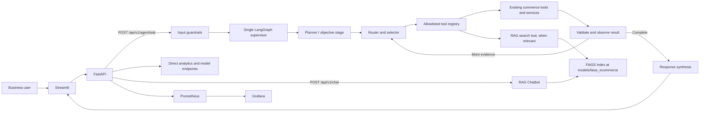

# AI Commerce Analytics Platform

[](https://www.python.org/)
[](https://fastapi.tiangolo.com/)
[](https://streamlit.io/)
[](https://www.docker.com/)
[](https://mlflow.org/)
[](https://faiss.ai/)

An end-to-end **AI-powered e-commerce analytics platform** combining customer analytics, predictive machine learning, NLP, recommendations, demand forecasting, a direct RAG knowledge workspace, and a single-supervisor Agentic Commerce Analyst.

The project is designed as a **production-style analytics and AI application**, with FastAPI for model serving and orchestration, Streamlit for the user interface, MLflow for experiment tracking, FAISS retrieval for the current RAG workflow, optional Ollama generation, and Prometheus/Grafana for monitoring.

---

## 🚀 Project Overview

The platform transforms raw e-commerce data into actionable customer and business intelligence.

It covers:

- Data preparation and feature engineering
- Exploratory data analysis
- Customer segmentation
- Churn prediction
- Customer Lifetime Value (CLV) prediction
- Delivery-delay risk prediction
- Demand forecasting
- Product recommendations
- Review sentiment analysis
- Retrieval-Augmented Generation (RAG)
- LangGraph agent orchestration over existing commerce services
- Experiment tracking
- API-based model serving
- Interactive analytics dashboards
- Application monitoring
- Containerized deployment

The project demonstrates the complete journey from:

**Raw Data → Data Preparation → Feature Engineering → ML/NLP → RAG → API → Dashboard → Monitoring**

---

# 🏗️ System Architecture


```mermaid
flowchart LR
  User[Business user] --> UI[Streamlit]
  UI --> API[FastAPI]
  API -->|POST /api/v1/agent/ask| Guard[Input guardrails]
  Guard --> Supervisor[Single LangGraph supervisor]
  Supervisor --> Planner[Planner / objective stage]
  Planner --> Selector[Router and selector]
  Selector --> Registry[Allowlisted tool registry]
  Registry --> Tools[Existing commerce tools and services]
  Tools --> Observe[Validate and observe result]
  Observe -->|More evidence| Selector
  Observe -->|Complete| Synthesize[Response synthesis]
  Synthesize --> UI
  API --> Direct[Direct analytics and model endpoints]
  API -->|POST /api/v1/chat| Chat[RAG Chatbot]
  Registry --> RAGTool[RAG search tool, when relevant]
  Chat --> Retriever[FAISS index at models/faiss_ecommerce]
  RAGTool --> Retriever
  API --> Prometheus[Prometheus]
  Prometheus --> Grafana[Grafana]
```

The Agentic Analyst uses one supervisor to select registered tools and decide from observed results whether more evidence is needed. It orchestrates existing services; it does not replace their ML or analytics logic. The RAG Chatbot remains a separate direct knowledge workspace.

---

# 🧩 Main Components

## 1. Data Pipeline

The project starts with e-commerce datasets containing information such as:

-  Customers 
-  Orders 
-  Order items 
-  Payments 
-  Products 
-  Sellers 
-  Reviews 
-  Geolocation 

The preparation pipeline:

1.  Loads raw datasets 
2.  Cleans inconsistent records 
3.  Handles missing values 
4.  Performs data type conversion 
5.  Joins related datasets 
6.  Creates customer-level features 
7.  Generates the prepared master dataset 
8.  Stores the processed data in Parquet format 

The resulting dataset is reused by downstream analytics and machine-learning workflows.

---

# 📊 Customer Analytics

The platform performs customer-level analytics using:

-  Recency 
-  Frequency 
-  Monetary value 
-  Customer KPIs 
-  Purchase behavior 
-  Spending patterns 
-  Customer lifetime trends 

## RFM Segmentation

Customers are scored using:

- **R — Recency** 
- **F — Frequency** 
- **M — Monetary Value** 

Quintile-based scoring is used to categorize customer behavior and identify valuable customer segments.

Interactive Plotly visualizations are provided through the Streamlit dashboard.

---

# 🤖 Machine Learning

The platform contains multiple predictive ML workflows.

## Customer Churn Prediction

Predicts whether a customer is likely to churn using customer behavioral features.

Models explored include:

-  XGBoost 
-  LightGBM 
-  CatBoost 

Model performance is evaluated using appropriate classification metrics.

---

## Customer Lifetime Value

Predicts customer lifetime value using customer-level behavioral and transactional features.

The workflow includes:

-  Feature engineering 
-  Model training 
-  Evaluation 
-  Artifact persistence 
-  API serving 

---

## Delivery Delay Prediction

The platform provides delivery-delay risk analysis based on available order and operational features.

The implementation distinguishes between:

-  Training experiments 
-  Current serving implementation 
-  Future model improvements 

This avoids claiming that an experimental model is automatically the production-serving model.

---

## Demand Forecasting

Demand forecasting is included as part of the commerce analytics workflow.

The platform exposes forecasting functionality through FastAPI and presents the resulting information through the dashboard.

---

# 🛍️ Recommendation System

A content-based recommendation system is implemented using:


```
Product Information
   ↓
Text Preprocessing
   ↓
TF-IDF Vectorization
   ↓
Cosine Similarity
   ↓
Similar Product Recommendations
```

The system recommends products based on content similarity rather than collaborative user behavior.

---

# 💬 Review Sentiment Analysis

The review analytics pipeline supports sentiment classification.

Two approaches are included.

### TF-IDF Baseline

A traditional machine-learning NLP pipeline using:


```
Review Text
   ↓
Text Cleaning
   ↓
TF-IDF
   ↓
Classifier
   ↓
Sentiment
```

### DistilBERT

An optional transformer-based approach providing:

-  3-class sentiment classification 
-  Confidence scoring 

The system therefore demonstrates both a lightweight NLP baseline and a transformer-based approach.

---

# 🧠 RAG Chatbot — direct knowledge workspace

The RAG Chatbot answers document-oriented questions using the project's indexed commerce evidence. It is a direct knowledge workspace at `POST /api/v1/chat`. The Agentic Analyst is a separate natural-language business entry point; its supervisor may use the registered RAG search tool alongside structured tools when document evidence is relevant.

## Current retrieval flow

The current RAG service loads the persisted FAISS index from `models/faiss_ecommerce/`. The Agentic Analyst `rag_search` tool calls this same retrieval service when document evidence is relevant.

```text
User question → FAISS retrieval → relevant indexed text → optional Ollama generation → answer + sources
```

Retrieved documents are evidence, not instructions. The agent and direct chatbot must not claim project facts that are absent from structured data and indexed documents.

---

# 🦙 Local LLM

The project uses:

**Ollama + Llama 3.2**

The configured backend endpoint is:


```
http://host.docker.internal:11434
```

When enabled, the LLM generates a response using retrieved commerce evidence; the current retriever uses FAISS.

This provides a local/private generation workflow without requiring a hosted LLM API for the core RAG demo.

---

# 🛡️ RAG Grounding and Fallback

The RAG pipeline is designed to avoid blindly generating answers.

The workflow retrieves supporting commerce information before generation.

The response contains:

-  Answer 
-  Sources 
-  Prompt version 
-  Knowledge-base version 
-  Evaluation metrics 

Example response structure:


```
{
  "answer": "The total revenue is 3294778880.00, as stated in the dashboard metrics.",
  "sources": [
"dashboard_metrics",
"dashboard_metrics",
"dashboard_metrics",
"products",
"products"
  ],
  "prompt_version": "2026-07-21.1",
  "knowledge_base_version": "faiss-1788012552746534000",
  "evaluation": {
"faithfulness": 0.571,
"answer_relevance": 0.75,
"context_relevance": 0.5
  }
}
```

The system can also fall back to retrieved evidence when LLM generation is unavailable.

---

# 📏 RAG Evaluation

The RAG system includes evaluation of:

-  Faithfulness 
-  Answer relevance 
-  Context relevance 
-  Latency 
-  Retrieval sources 

This helps distinguish between:

**retrieval quality → generation quality → final answer quality**

rather than evaluating the chatbot only by whether an answer was produced.

---

# 🔬 Experiment Tracking

MLflow is used to track machine-learning experiments.

Tracked information can include:

-  Parameters 
-  Metrics 
-  Model artifacts 
-  Evaluation results 
-  Plots 
-  Dataset context 
-  Training metadata 

The project uses MLflow as part of the model development and operational workflow.

---

# 🌐 FastAPI Backend

FastAPI provides the backend API layer.

Current API endpoints include:


```
/api/v1/analytics/customer-metrics
/api/v1/chat
/api/v1/agent/ask
/api/v1/forecast/demand
/api/v1/health
/api/v1/predictions/churn
/api/v1/predictions/clv
/api/v1/predictions/delivery-delay
/api/v1/rag/metrics
/api/v1/recommendations/{customer_id}
/api/v1/sentiment
```

### Agentic Commerce Analyst

The **Agentic Analyst** Streamlit page calls `POST /api/v1/agent/ask`. FastAPI runs a single bounded LangGraph supervisor whose allowlisted tools wrap the existing analytics, saved-model, recommendation, forecasting, sentiment, anomaly, and RAG services. It selects one tool, validates and observes the result, then decides on the next action from request goals and prior results. Ollama planning/selection can be disabled with `AGENT_PLANNER_ENABLED=false`; deterministic routing remains available. Customer cohort predictions use only fields present in the engineered customer rows and the saved model's `feature_names_in_` contract. Churn and CLV failures can execute real, clearly labeled recency-risk and historical-spend fallbacks.

The implementation lives under `backend/app/agents`, `backend/app/tools`, `backend/app/guardrails`, and `backend/app/evaluation`; the API route is `backend/app/api/agent.py`; the UI is `streamlit/pages/13_Agentic_Analyst.py`; and the walkthrough is `notebooks/11_Agentic_AI_Orchestration.ipynb`. Memory is request-scoped; this is not a multi-agent system, and toxicity/misuse classification is not implemented. Existing direct API and RAG workflows remain available. Agent telemetry is exposed through the existing Prometheus `/metrics` endpoint. See [Agentic AI Orchestration](docs/11_Agentic_AI_Orchestration.md) for the implementation map and limitations.

Interactive API documentation is available through Swagger UI.

---

# 🖥️ Streamlit Dashboard

The Streamlit application provides an interactive interface for:

-  Customer analytics 
-  Predictions 
-  Recommendations 
-  Sentiment analysis 
-  Demand forecasting 
-  Agentic Analyst for natural-language business questions
-  RAG Chatbot as a direct indexed-knowledge workspace
-  RAG operations 
-  Monitoring information 

The dashboard communicates with the FastAPI backend rather than directly executing model logic.

This keeps the application architecture separated into:


```
Streamlit
↓
FastAPI
↓
Service Layer
↓
Models / Data / RAG
```

---

# 📈 Monitoring

The application exposes Prometheus metrics through:


```
/metrics
```

The monitoring stack includes:

-  Prometheus 
-  Grafana 

Metrics can be used to monitor:

-  API requests 
-  API latency 
-  Application health 
-  Model-related operations 
-  RAG activity 
-  Infrastructure behavior 

Grafana dashboards provide a visual monitoring layer.

---

# 🔍 Optional LangSmith Tracing

LangSmith can be enabled for RAG observability.

When enabled, it can provide visibility into the RAG pipeline:


```
Question
   ↓
Retriever
   ↓
Retrieved Documents
   ↓
Prompt
   ↓
LLM
   ↓
Final Response
```

LangSmith is optional and is not required for the core application to run.

---

# 🐳 Docker Deployment

Docker Compose orchestrates the main application services.

The architecture separates:

-  Backend 
-  Dashboard 
-  MLflow 
-  Monitoring services 

Start the application:


```
docker compose up --build -d
```

Check running containers:


```
docker compose ps
```

View backend logs:


```
docker compose logs --tail=100 backend
```

---

# 🔗 Application URLs

| ServiceURL          |                                                          |
| ------------------- | -------------------------------------------------------- |
| Streamlit Dashboard | [http://localhost:8501](http://localhost:8501)           |
| FastAPI Swagger     | [http://localhost:8000/docs](http://localhost:8000/docs) |
| FastAPI OpenAPI     | http\://localhost:8000/openapi.json                      |
| Health Check        | http\://localhost:8000/api/v1/health                     |
| MLflow              | [http://localhost:5000](http://localhost:5000)           |
| Prometheus          | [http://localhost:9090](http://localhost:9090)           |
| Grafana             | [http://localhost:3000](http://localhost:3000)           |

---

# 🧪 Testing the RAG API

The RAG chatbot can be tested directly through the backend container.

Example:


```
docker compose exec backend python -c "import urllib.request,json; data=json.dumps({'question':'What is the total revenue?','limit':5}).encode(); req=urllib.request.Request('http://127.0.0.1:8000/api/v1/chat',data=data,headers={'Content-Type':'application/json'}); print(urllib.request.urlopen(req,timeout=120).read().decode())"
```

A successful response should contain:


```
answer
sources
prompt_version
knowledge_base_version
evaluation
```

---

# 📁 Project Structure


```
AI-Commerce-Analytics-Platform/
│
├── backend/
│   ├── app/
│   │   ├── agents/       # One LangGraph supervisor and request-scoped state
│   │   ├── api/          # REST routes, including POST /agent/ask
│   │   ├── tools/        # Allowlisted adapters around existing services
│   │   ├── guardrails/   # Lightweight input/output checks
│   │   ├── evaluation/   # Runtime execution evaluation
│   │   ├── services/    # Existing analytics, ML, and RAG services
│   │   ├── schemas/
│   │   └── main.py
│   └── requirements.txt
│
├── streamlit/
│   └── pages/
│
├── src/
│   ├── data/
│   ├── features/
│   └── services/
│
├── pipelines/
│   ├── data/
│   ├── evaluation/
│   ├── features/
│   ├── services/
│   └── training/
│
├── data/
│   └── processed/
│       └── master_df.parquet
│
├── models/
│   ├── customer_churn_model.joblib
│   ├── customer_clv_model.joblib
│   ├── customer_review_sentiment_model.joblib
│   ├── demand_forecasting_model.joblib
│   ├── product_recommender_system.joblib
│   └── faiss_ecommerce/  # Persisted RAG index
│
├── rag_ops/
│   └── RAG evaluation and operational artifacts
│
├── notebooks/
│   └── 01–11 analysis and modeling notebooks (including Agentic AI walkthrough)
│
├── docs/
│   ├── 01_Project_Overview.md
│   ├── 02_System_Architecture.md
│   ├── 03_Data_Pipeline.md
│   ├── 04_Machine_Learning.md
│   ├── 05_RAG_Architecture.md
│   ├── 06_API_Documentation.md
│   ├── 07_Deployment_Guide.md
│   ├── 08_Project_Structure.md
│   ├── 09_Monitoring.md
│   ├── 10_README.md
│   └── 11_Agentic_AI_Orchestration.md
│
├── docker-compose.yml
├── prometheus.yml
└── README.md
```

---

# 🛠️ Technology Stack

## Programming & Data

-  Python 3.13 
-  SQL 
-  Pandas 
-  NumPy 
-  PyArrow 

## Machine Learning

-  Scikit-learn 
-  XGBoost 
-  LightGBM 
-  CatBoost 
-  SHAP 

## NLP & Generative AI

-  TF-IDF 
-  DistilBERT 
-  LangChain 
-  LangGraph orchestration
-  FAISS retrieval
-  Hugging Face embeddings
-  Ollama 
-  Llama 3.2 
-  Retrieval-Augmented Generation 

## Backend & Application

-  FastAPI 
-  Uvicorn 
-  Streamlit 
-  Plotly 

## MLOps & Observability

-  MLflow 
-  Prometheus 
-  Grafana 
-  Optional LangSmith 

## Deployment

-  Docker 
-  Docker Compose 
-  GitHub Actions 

---

# 🎯 Key Engineering Concepts Demonstrated

## Data Science

-  EDA 
-  Feature engineering 
-  RFM segmentation 
-  Statistical analysis 
-  Predictive modeling 
-  Model evaluation 
-  Explainable AI 

## Machine Learning

-  Classification 
-  Regression 
-  Gradient boosting 
-  Imbalanced learning 
-  Threshold tuning 
-  Model comparison 
-  SHAP interpretation 

## NLP

-  TF-IDF 
-  Sentiment classification 
-  Transformer models 
-  Semantic retrieval 

## Generative AI

-  RAG architecture 
-  FAISS retrieval
-  Evidence validation
-  Result-aware tool orchestration
-  Prompt construction 
-  Local LLM inference 
-  Grounded generation 
-  RAG evaluation 

## AI Engineering

-  FastAPI model serving 
-  Service-layer architecture 
-  Lazy model loading 
-  Persisted model artifacts 
-  API contracts 
-  Dockerized services 
-  Observability 
-  Experiment tracking 

---

# 📌 Design Principles

The project follows several practical engineering principles.

### Separation of Concerns

Data preparation, model training, serving, UI, RAG, and monitoring are separated into different components.

### Reusable Artifacts

Models and the RAG knowledge base are persisted so they can be loaded during serving rather than rebuilt for every request.

### API-First Architecture

Streamlit communicates with the backend through FastAPI APIs.

### Observable AI

The RAG system records retrieval sources and evaluation information rather than treating the LLM as a black box.

### Production-Style Deployment

Docker Compose provides reproducible local deployment of the application stack.
