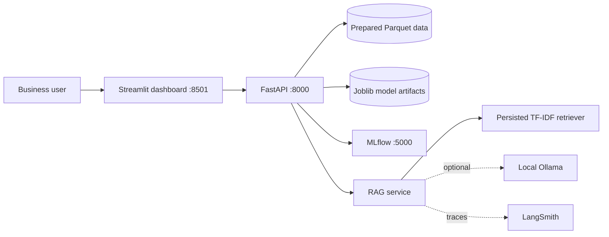
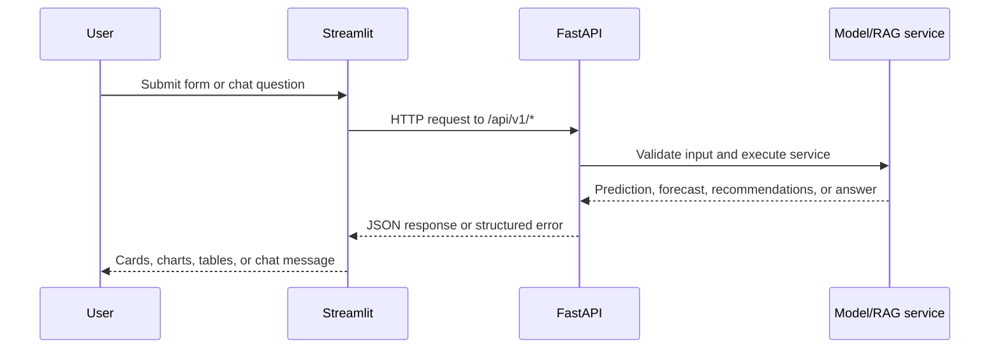
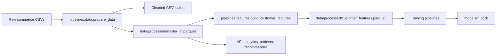
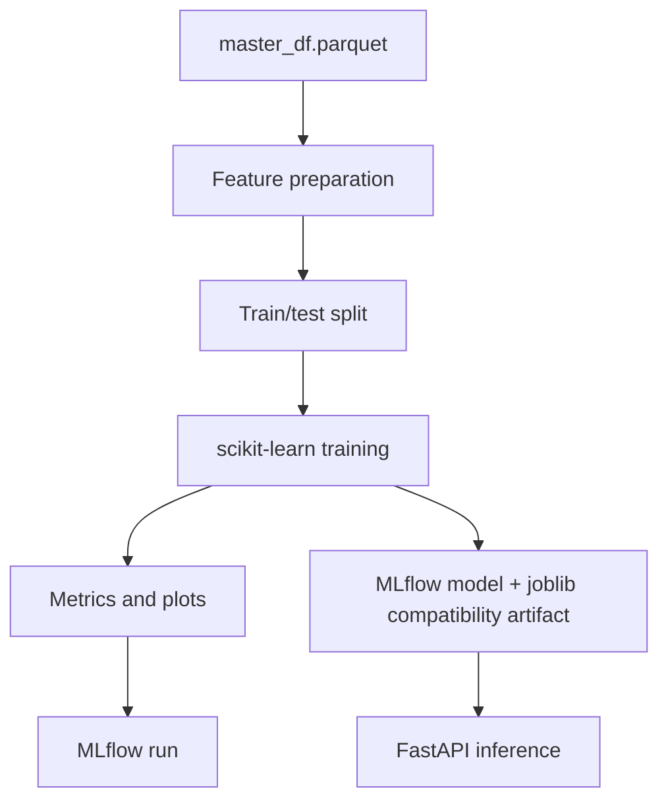
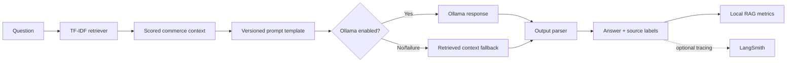
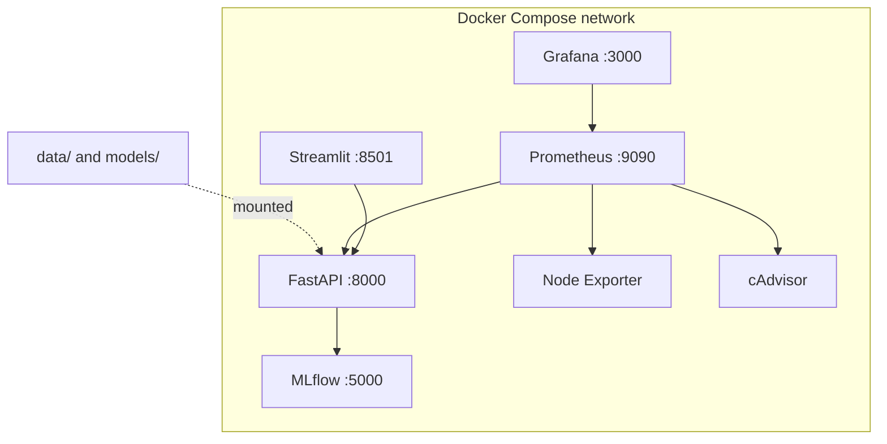
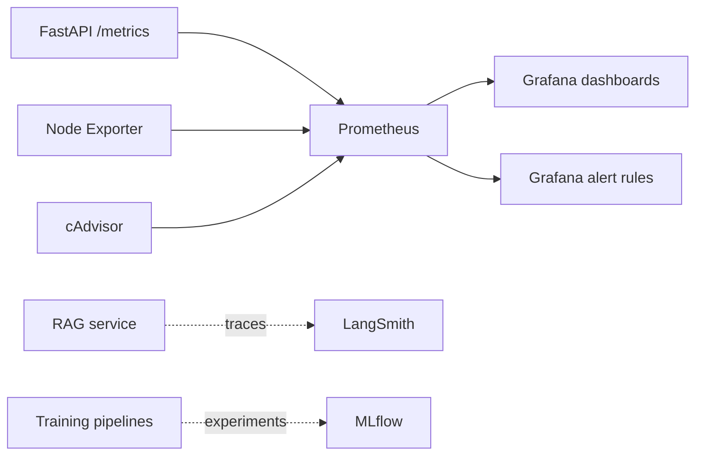
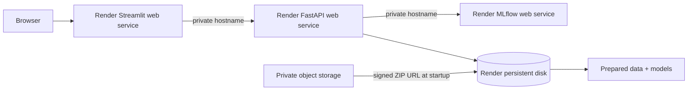

# System Architecture

## Overall architecture

## Request flow

## Data flow

## ML pipeline

## RAG pipeline

## Docker architecture

## Monitoring architecture

## Deployment architecture

## Architectural principles

- Services load data and model artifacts lazily to keep API startup lightweight.
- The frontend uses backend service DNS in Docker and private hostnames on Render, not `localhost`.
- User content is excluded from local RAG logs; LangSmith tracing is opt-in.
- Prometheus labels use bounded values such as route, status, model, and outcome.
