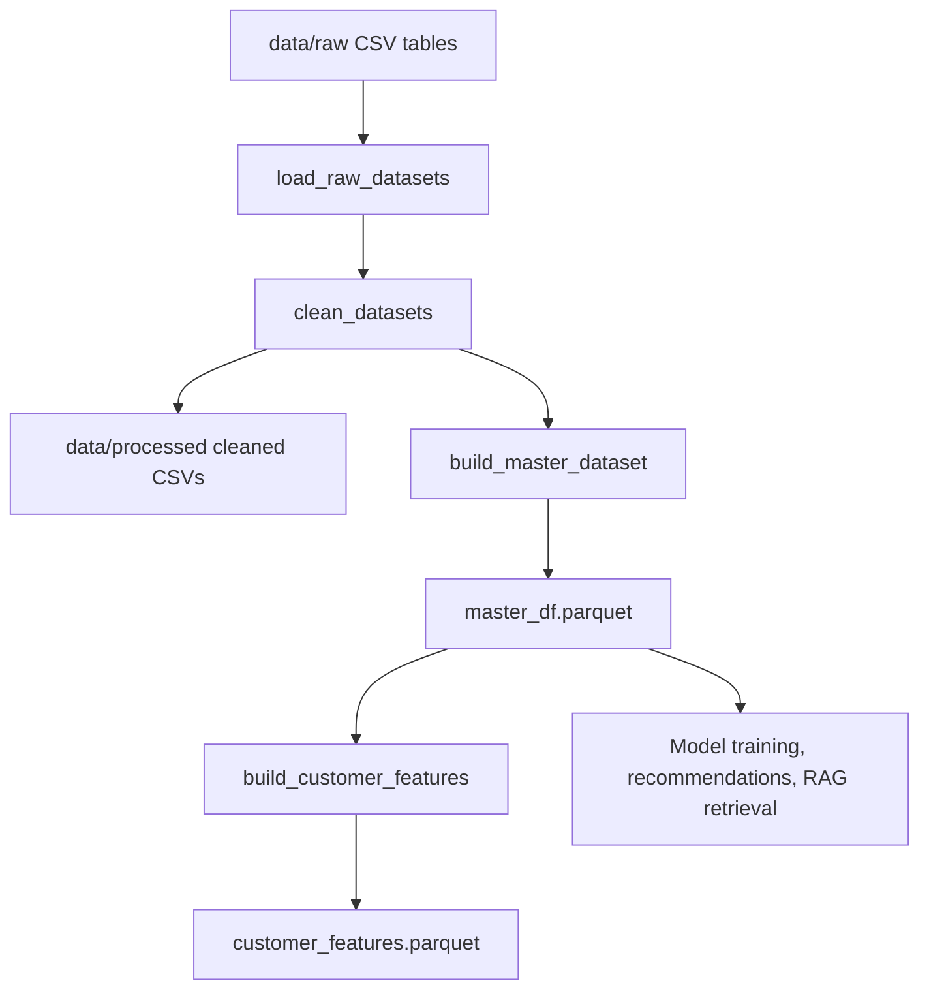

# Data Pipeline

## Dataset

The project uses commerce tables representing customers, orders, order items, payments, reviews, products, sellers, and geolocation. Raw data is expected beneath `data/raw/`; cleaned outputs are written to `data/processed/`.

| Input area | Example analytical use |
| --- | --- |
| Customers and orders | Customer identity, purchase recency, order counts |
| Order items and products | Product interactions, categories, prices |
| Payments | Revenue, order value, freight and payment features |
| Reviews | Sentiment labels and RAG review documents |
| Sellers/geolocation | Seller and delivery context |

## Cleaning and preparation

Run the preparation job:

```powershell
python -m pipelines.data.prepare_data
```

The job loads raw tables through `src.data`, applies table-specific cleaning, writes cleaned CSV tables, builds a master dataset, and persists it as `master_df.parquet`.

## Feature engineering

Run customer-level feature construction:

```powershell
python -m pipelines.features.build_customer_features
```

The customer feature job aggregates order behavior into fields used by churn and CLV workflows, including frequency, monetary value, recency, total spend, average order value, review score, discount rate, freight, product diversity, and delivery delay where present.

## Data flow



## Storage contracts

| Location | Purpose | Git policy |
| --- | --- | --- |
| `data/raw/` | Original source extracts | Ignored; do not commit private/commercial data |
| `data/processed/*.csv` | Cleaned tables for inspection | Ignored/generated |
| `data/processed/master_df.parquet` | Main API and pipeline input | Ignored/generated; mounted into backend |
| `data/processed/customer_features.parquet` | Customer modeling table | Ignored/generated |
| `models/` | Serialized artifacts | Ignored/generated; mounted read-only into backend |

## Data quality checks

Before training or deployment, verify:

- Primary keys and joins are not unexpectedly duplicated.
- Timestamp parsing succeeds and required dates are non-null.
- Monetary fields are numeric and non-negative where expected.
- The target and required feature columns are available.
- The processed schema is compatible with the model artifact’s expected feature names.

## Operational notes

- The Docker backend reads `/app/data/processed/master_df.parquet`.
- The Render startup script expects `processed/master_df.parquet` inside the private asset bundle.
- Rebuild the RAG retriever and recommender whenever the master data changes materially.
