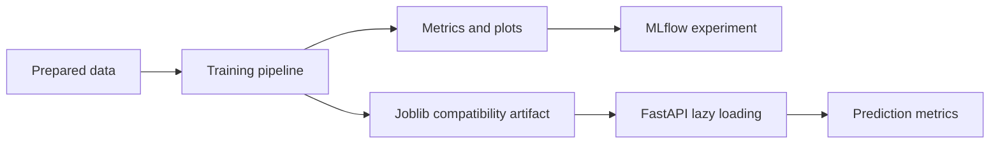

# Machine Learning

Training entry point:

```powershell
python -m pipelines.training.train all
```

Training runs log parameters, metrics, plots, model artifacts, feature names, dataset version context, random seed, and timing to MLflow. Joblib artifacts are retained for backward-compatible API serving.

## Model summary

| Module | Business problem | Current algorithm | Primary metrics | Output |
| --- | --- | --- | --- | --- |
| Churn | Identify customers likely to churn | Random Forest classifier | Accuracy, precision, recall, F1, ROC-AUC, PR-AUC | Class and probability |
| CLV | Estimate future customer value proxy | Random Forest regressor | RMSE, MAE, R² | Monetary estimate |
| Delivery delay | Estimate late-delivery days | Random Forest training pipeline; API uses transparent date-window baseline | RMSE, MAE, R² | Delay days and risk |
| Recommendations | Suggest products not yet seen | Popular-unseen recommender | Precision@10, Recall@10, MAP@10, NDCG@10 | Ranked product IDs |
| Sentiment | Classify review tone | TF-IDF + Logistic Regression | Accuracy, precision, recall, F1, ROC-AUC, PR-AUC | Sentiment label |
| Forecasting | Forecast daily order demand | Random Forest on elapsed-day baseline | RMSE, MAE, R², MAPE | Daily demand points |

## Churn prediction

**Business problem:** prioritize retention activity for customers with behavior consistent with churn.

**Features:** customer-level numeric purchase, recency, spending, review, freight, discount, delivery, and category-diversity features.

**Algorithm:** `RandomForestClassifier` with balanced class weighting.

**Output:** `/api/v1/predictions/churn` returns `prediction` and, where available, `probability`.

## Customer lifetime value (CLV)

**Business problem:** estimate a customer value proxy to support prioritization and segmentation.

**Features:** numeric customer aggregates excluding direct leakage fields such as target spend and identifiers.

**Algorithm:** `RandomForestRegressor` predicting `total_spend`.

**Output:** `/api/v1/predictions/clv` returns a numeric prediction.

## Delivery delay prediction

**Business problem:** flag fulfilment plans that may create delivery risk.

**Training features:** payment value, freight value, discount rate, and review score where available; target is actual minus estimated delivery date.

**Algorithm:** Random Forest regression pipeline. The currently exposed API endpoint uses a documented date-window baseline until a serving artifact is wired into `MODEL_FILES`.

**Output:** `/api/v1/predictions/delivery-delay` returns `predicted_delay_days` and a `low`, `medium`, or `high` risk band.

## Product recommendation

**Business problem:** improve discovery by proposing popular products the customer has not interacted with.

**Features:** unique customer-product interactions.

**Algorithm:** popularity ranking with seen-product exclusion. This is an interpretable baseline, not collaborative filtering.

**Output:** `/api/v1/recommendations/{customer_id}` returns product IDs.

## Review sentiment analysis

**Business problem:** summarize customer experience from review text.

**Features:** review text; positive label is derived from review score `>= 4` during training.

**Algorithm:** `TfidfVectorizer(max_features=10000, stop_words="english")` followed by `LogisticRegression`.

**Output:** `/api/v1/sentiment` returns a label. If the artifact is unavailable, a limited keyword fallback preserves dashboard availability and logs a warning.

## Demand forecasting

**Business problem:** estimate daily order demand for planning.

**Features:** elapsed day index over historical daily unique-order volume.

**Algorithm:** Random Forest regression baseline with chronological 80/20 split.

**Output:** `/api/v1/forecast/demand` returns dated forecast points. The serving endpoint currently uses a recent-observation baseline for reliable lightweight inference.

## Model lifecycle



## Responsible use

- Treat predictions as decision support, not autonomous business decisions.
- Compare metric performance across relevant customer cohorts before rollout.
- Retrain after material data, feature, or behavior changes.
- Version both data and artifacts; record feature schema compatibility.
