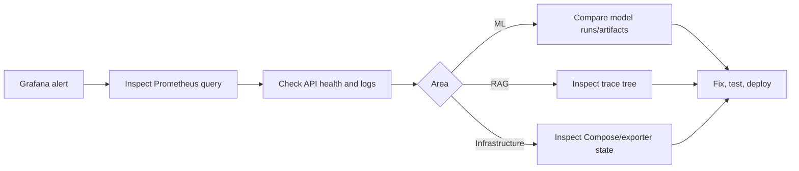

# Monitoring and Observability

## Tool responsibilities

| Tool | Primary question answered | Data captured |
| --- | --- | --- |
| MLflow | Which model version performed best during training? | Parameters, metrics, plots, model artifacts, run context |
| LangSmith | What happened inside a RAG request? | Optional question/context/prompt/answer traces, timing, nested errors |
| Prometheus | Is the service healthy and performing well now? | Numeric time-series metrics |
| Grafana | Can operators quickly understand trends and alerts? | Prometheus visualizations and alert state |

## MLflow

Open: http://localhost:5000

The training pipeline logs classification, regression, ranking, and forecasting metrics plus plots. Use MLflow to compare experimental runs and inspect artifacts before promoting or replacing a serving artifact.

## LangSmith

LangSmith is opt-in for the RAG chatbot only.

```dotenv
LANGCHAIN_TRACING_V2=true
LANGCHAIN_API_KEY=<key>
LANGCHAIN_PROJECT=AI-Commerce-Analytics-Platform
```

Expected run names:

- `ai_commerce_rag_pipeline`
- `rag_retriever`
- `rag_prompt_template`
- `rag_ollama_request`
- `rag_llm`
- `rag_output_parser`

Use the trace tree to debug retrieval quality, prompt rendering, timeout errors, fallback behavior, token counters, and complete response time.

## Prometheus

Open: http://localhost:9090  
Raw metrics: http://localhost:8000/metrics

Prometheus scrapes FastAPI, itself, Node Exporter, and cAdvisor every 15 seconds. The most important custom metric families are:

| Domain | Metrics |
| --- | --- |
| HTTP | `http_requests_total`, `http_request_duration_seconds`, `http_errors_total`, `active_requests` |
| ML | `prediction_requests_total`, `prediction_errors_total`, `prediction_latency_seconds`, `model_loading_seconds`, `loaded_models` |
| RAG | `chatbot_requests_total`, `chatbot_errors_total`, `rag_latency_seconds`, `rag_retriever_latency_seconds`, `rag_llm_latency_seconds`, `rag_retrieved_documents` |
| Infrastructure | Node Exporter and cAdvisor host/container metrics |

## Grafana

Open: http://localhost:3000

Grafana provisions a Prometheus datasource and four dashboards:

1. FastAPI API Monitoring
2. Machine Learning Monitoring
3. RAG Chatbot Monitoring
4. Infrastructure Monitoring

Seven Grafana-managed alert rules are included. They appear in the UI but require a contact point and notification policy before they notify a team.

## Incident workflow



## Baseline checks

```powershell
docker compose ps
Invoke-RestMethod http://localhost:8000/api/v1/health
Invoke-WebRequest http://localhost:8000/metrics
```

Then inspect:

- Prometheus targets: `http://localhost:9090/targets`
- Grafana alert rules: `http://localhost:3000/alerting/list`
- MLflow experiments: `http://localhost:5000`

## Privacy and retention

- Avoid labels containing customer IDs, prompts, reviews, full URLs, or feature values.
- Keep Prometheus/Grafana behind private networking or authentication in production.
- Treat LangSmith content as externally stored observability data when tracing is enabled.
- Back up and define retention policies for `mlflow/`, `grafana_data`, and `prometheus_data`.
