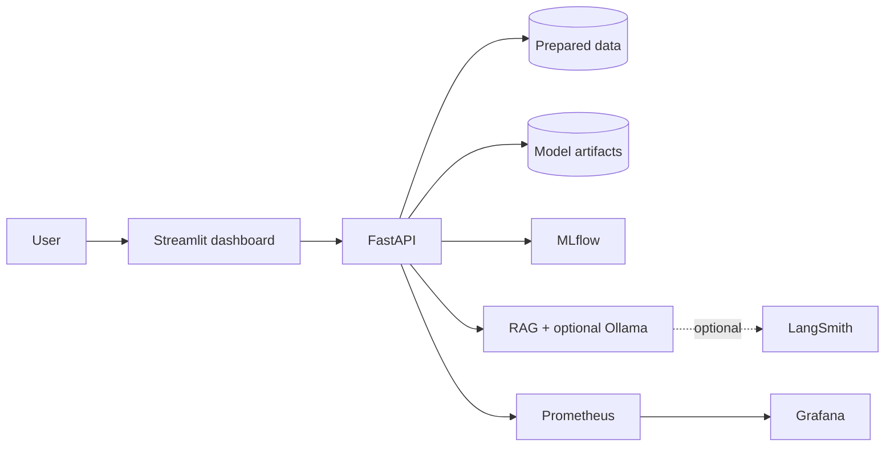

# AI Commerce Analytics Platform

<!-- Replace with a branded product/banner image when available. -->


[](../../actions/workflows/ci.yml)


An end-to-end AI commerce analytics workspace that combines customer intelligence, machine-learning predictions, product recommendations, review sentiment, demand forecasting, and a retrieval-assisted commerce chatbot.

## Why this project

The platform demonstrates how to move from prepared e-commerce data to a user-facing analytics product with model tracking, RAG observability, containerized deployment, CI, and operational monitoring.

## Architecture



## Features

- Customer analytics KPIs and customer-focused dashboard views.
- Churn and CLV predictions through FastAPI.
- Delivery risk assessment, product recommendations, sentiment analysis, and demand forecasting.
- RAG chatbot with source labels, prompt/knowledge-base versioning, and optional local Ollama generation.
- MLflow experiment tracking and artifact logging.
- LangSmith tracing and offline RAG evaluation.
- Prometheus metrics, Grafana dashboards, and provisioned alert rules.
- Docker Compose and GitHub Actions CI.

## Tech stack

Python 3.13 · FastAPI · Streamlit · pandas · NumPy · scikit-learn · XGBoost · LightGBM · MLflow · Ollama · LangSmith · Prometheus · Grafana · Docker Compose · GitHub Actions

## Quick start

```powershell
git clone <your-repository-url>
cd AI-Commerce-Analytics-Platform
Copy-Item .env.example .env
docker compose up --build -d
```

| Service | URL |
| --- | --- |
| Dashboard | http://localhost:8501 |
| API docs | http://localhost:8000/docs |
| MLflow | http://localhost:5000 |
| Prometheus | http://localhost:9090 |
| Grafana | http://localhost:3000 |

Grafana local-development login: `admin` / `admin`. Change the password in `.env` before sharing the stack.

## Run locally without Docker

Install backend and UI dependencies, ensure `data/processed/master_df.parquet` and model artifacts exist, then run FastAPI and Streamlit in separate terminals. Docker Compose is the recommended path because it configures service networking, MLflow, Prometheus, and Grafana automatically.

## Model operations

```powershell
docker compose exec backend python -m pipelines.training.train all
```

Open MLflow to compare metrics, artifacts, plots, and run metadata. See [Machine Learning](04_Machine_Learning.md) for the current baselines and their limitations.

## RAG and LangSmith

Enable tracing only after adding a LangSmith key to `.env`:

```dotenv
LANGCHAIN_TRACING_V2=true
LANGCHAIN_API_KEY=<your-key>
LANGCHAIN_PROJECT=AI-Commerce-Analytics-Platform
```

The active retriever is TF-IDF. FAISS/LangChain are future integration directions, not runtime requirements for the current chatbot.

## Observability

FastAPI exports Prometheus metrics at `/metrics`. Grafana auto-loads API, ML, RAG, and infrastructure dashboards from the repository. See [Monitoring](09_Monitoring.md) for metrics, alerting, and incident workflow.

## Screenshots

| Placeholder | Suggested screenshot |
| --- | --- |
| `images/streamlit-dashboard.png` | Home dashboard |
| `images/swagger-ui.png` | FastAPI docs |
| `images/mlflow.png` | Model experiment comparison |
| `images/langsmith.png` | RAG trace tree |
| `images/grafana.png` | API or RAG dashboard |

## Demo ideas

1. Open Streamlit and inspect customer KPIs.
2. Submit a churn or CLV prediction.
3. Ask the RAG chatbot a commerce question.
4. Inspect the resulting Prometheus metrics and Grafana panels.
5. Enable LangSmith tracing and inspect the RAG stage tree.

## Documentation

- [Project Overview](01_Project_Overview.md)
- [System Architecture](02_System_Architecture.md)
- [Data Pipeline](03_Data_Pipeline.md)
- [Machine Learning](04_Machine_Learning.md)
- [RAG Architecture](05_RAG_Architecture.md)
- [API Documentation](06_API_Documentation.md)
- [Deployment Guide](07_Deployment_Guide.md)
- [Project Structure](08_Project_Structure.md)
- [Monitoring](09_Monitoring.md)

## Future improvements

- Replace baseline recommenders/forecasts with validated advanced approaches.
- Add authentication, authorization, and rate limiting to FastAPI.
- Add automated data validation and drift monitoring.
- Migrate the retriever to FAISS or another vector store when semantic retrieval is required.
- Add alert contact points, SLOs, and managed production observability.

## License

Add the license that matches your intended reuse policy, for example MIT. Do not claim an open-source license until a `LICENSE` file has been added.
